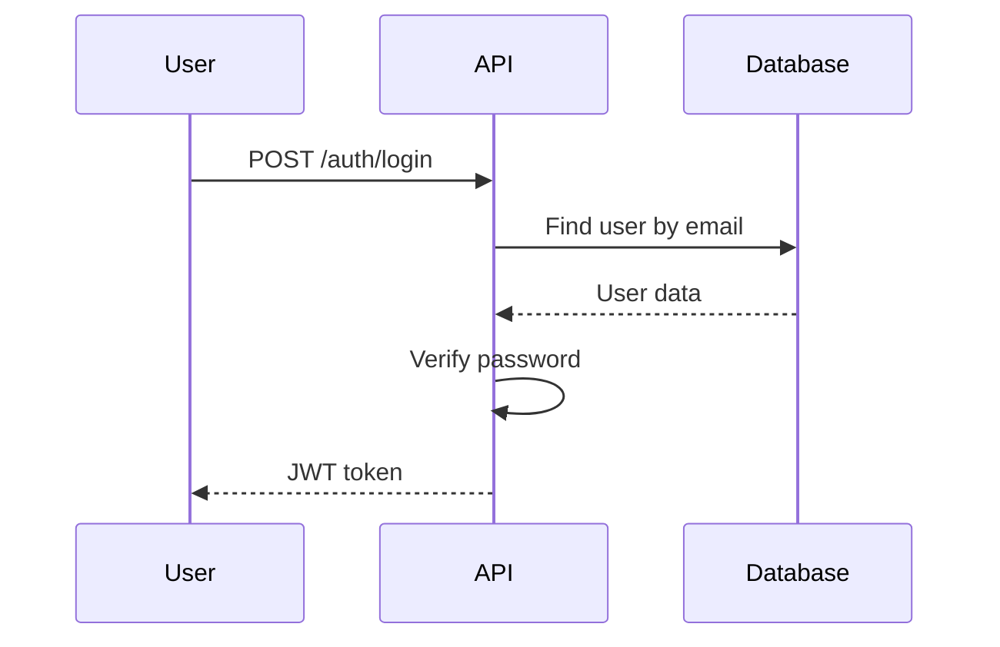

## Documentation Update

<!-- One sentence explaining what is documented -->

Example: Add API reference for authentication endpoints

---

## What's Being Documented?

### Documentation Type
- [ ] **README update**
- [ ] **API reference**
- [ ] **Getting started guide**
- [ ] **Tutorial**
- [ ] **Architecture documentation**
- [ ] **Contributing guide**
- [ ] **Migration guide**
- [ ] **FAQ**

---

## Changes Made

### Files Added/Modified
```bash
docs/api/authentication.md
docs/getting-started.md
README.md
```

### Documentation Updates
<!-- List what's new or improved -->
- Added complete API reference for all auth endpoints
- Added authentication flow diagrams
- Added code examples for each endpoint
- Updated README with quick start guide

---

## Documentation Checklist

### Content Quality
- [ ] Clear and concise language
- [ ] No typos or grammatical errors
- [ ] Code examples are runnable
- [ ] Screenshots are clear and relevant
- [ ] Diagrams aid understanding

### Completeness
- [ ] All parameters documented
- [ ] All return types specified
- [ ] Error cases documented
- [ ] Edge cases mentioned
- [ ] Prerequisites listed

### Examples
<!-- Include examples in this PR -->
```typescript
// Example from docs
const result = await authenticateUser({
  email: 'user@example.com',
  password: 'secure-password'
})

if (!result.ok) {
  console.error('Authentication failed:', result.error)
} else {
  console.log('Authenticated:', result.value)
}
```

### Accessibility
- [ ] Headers follow proper hierarchy
- [ ] Links work correctly
- [ ] Code blocks have language tags
- [ ] Images have alt text
- [ ] Mobile-friendly formatting

---

## Documentation Metrics

### Coverage
<!-- What percentage of the feature is documented -->
- API coverage: 100% (all endpoints documented)
- Parameter documentation: 100%
- Example coverage: 80%

### Screenshots/Diagrams
<!-- Visual assets included -->
- Authentication flow diagram: `docs/diagrams/auth-flow.mermaid`
- API response examples: `docs/api/responses.md`

---

## Review Focus Areas

### For Reviewers
<!-- What to focus on -->
- **Technical accuracy**: Are the code examples correct?
- **Clarity**: Is it easy to understand?
- **Completeness**: Is anything missing?
- **Tone**: Is it appropriate for the audience?

### Target Audience
<!-- Who is this documentation for? -->
- [ ] Developers (technical)
- [ ] Designers
- [ ] Product managers
- [ ] End users
- [ ] New contributors

---

## Related Links

- [Related Issue](#)
- [Documentation Site](link)
- [Previous Version](link)

---

## Visual Assets

<!-- Include diagrams, screenshots, etc. -->

### Authentication Flow Diagram


---

*Documentation Pages: 5 new pages, 3 updated*
*Word Count: ~2,500 words*
*Code Examples: 12 examples*
